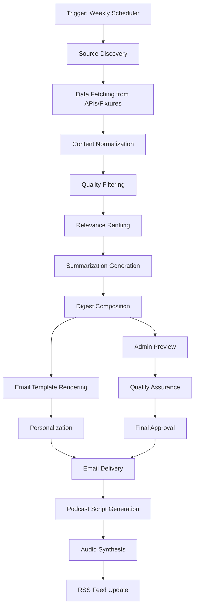

# Bite Size Academic - Execution Plan

## System Architecture Overview

### High-Level Architecture
```
┌─────────────────┐    ┌─────────────────┐    ┌─────────────────┐
│   Data Sources  │    │  Content Engine │    │  Delivery Layer │
│                 │    │                 │    │                 │
│ • arXiv         │───▶│ • Curation      │───▶│ • Email Service │
│ • Crossref      │    │ • Summarization │    │ • RSS Feeds     │
│ • PubMed        │    │ • Audio Gen     │    │ • Web Interface │
│ • RSS Feeds     │    │ • QA Checks     │    │ • Admin Panel   │
└─────────────────┘    └─────────────────┘    └─────────────────┘
         │                       │                       │
         ▼                       ▼                       ▼
┌─────────────────┐    ┌─────────────────┐    ┌─────────────────┐
│   Mock Layer    │    │   Storage Layer │    │   Monitoring    │
│                 │    │                 │    │                 │
│ • API Mocks     │    │ • Files         │    │ • Health Checks │
│ • Email Mocks   │    │ • Cache         │    │ • Performance   │
│ • Audio Mocks   │    │ • Artifacts     │    │ • Analytics     │
│ • Billing Mocks │    │ • Backups       │    │ • Alerts        │
└─────────────────┘    └─────────────────┘    └─────────────────┘
```

### Service Components

#### 1. Content Ingestion Service
```typescript
interface ContentIngestionService {
  // Primary data collection methods
  fetchFromArXiv(field: AcademicField): Promise<Article[]>;
  fetchFromCrossref(field: AcademicField): Promise<Article[]>;
  fetchFromPubMed(field: AcademicField): Promise<Article[]>;
  fetchFromRSSFeeds(feeds: RSSFeed[]): Promise<Article[]>;

  // Data normalization and enrichment
  normalizeArticles(rawArticles: RawArticle[]): Promise<NormalizedArticle[]>;
  enrichWithMetadata(articles: NormalizedArticle[]): Promise<EnrichedArticle[]>;

  // Quality filtering and ranking
  filterByQuality(articles: EnrichedArticle[]): Promise<FilteredArticle[]>;
  rankByRelevance(articles: FilteredArticle[], userPreferences: UserPreferences): Promise<RankedArticle[]>;

  // Mock mode support
  fetchFromFixtures(field: AcademicField): Promise<MockArticle[]>;
}
```

#### 2. Content Generation Service
```typescript
interface ContentGenerationService {
  // Summarization and analysis
  generateSummary(article: Article): Promise<ArticleSummary>;
  generateWhyThisMatters(article: Article, field: AcademicField): Promise<string>;
  estimateReadingTime(article: Article): Promise<number>;

  // Digest composition
  composeWeeklyDigest(articles: RankedArticle[], field: AcademicField): Promise<WeeklyDigest>;
  personalizeDigest(digest: WeeklyDigest, user: User): Promise<PersonalizedDigest>;

  // Audio content generation
  generatePodcastScript(digest: WeeklyDigest): Promise<PodcastScript>;
  optimizeForAudio(script: PodcastScript): Promise<AudioOptimizedScript>;

  // Template rendering
  renderEmailDigest(digest: PersonalizedDigest): Promise<RenderedEmail>;
  renderAdminPreview(digest: WeeklyDigest): Promise<AdminPreview>;
}
```

#### 3. Delivery Service
```typescript
interface DeliveryService {
  // Email delivery
  sendWeeklyDigest(emails: RenderedEmail[], recipients: User[]): Promise<DeliveryResults>;
  sendWelcomeEmail(user: User): Promise<DeliveryResult>;
  sendPreferenceUpdateEmail(user: User): Promise<DeliveryResult>;

  // Audio delivery
  generateAudioFile(script: AudioOptimizedScript): Promise<AudioFile>;
  createRSSFeed(episodes: PodcastEpisode[]): Promise<RSSFeed>;

  // Web interface
  serveLandingPage(): Promise<PageContent>;
  servePreferencePage(user: User): Promise<PreferencePage>;
  serveAdminPanel(admin: Admin): Promise<AdminPanel>;

  // Mock delivery methods
  saveEmailLocally(email: RenderedEmail): Promise<string>;
  saveAudioLocally(audio: AudioFile): Promise<string>;
  simulateDelivery(email: RenderedEmail): Promise<DeliveryStats>;
}
```

#### 4. User Management Service
```typescript
interface UserManagementService {
  // Registration and authentication
  registerUser(email: string, field: AcademicField): Promise<User>;
  confirmEmail(confirmationCode: string): Promise<User>;
  authenticateUser(credentials: UserCredentials): Promise<AuthResult>;

  // Preferences and subscriptions
  updatePreferences(userId: string, preferences: UserPreferences): Promise<User>;
  upgradeToPremium(userId: string): Promise<User>;
  cancelSubscription(userId: string): Promise<User>;

  // Admin functions
  listUsers(filters: UserFilters): Promise<User[]>;
  exportUsers(format: 'csv' | 'json'): Promise<string>;
  manageUserStatus(userId: string, status: UserStatus): Promise<User>;
}
```

## Data Flow Architecture

### Weekly Digest Pipeline



### Data Transformation Layers

#### Layer 1: Raw Data Collection
```typescript
interface RawDataLayer {
  // API responses from academic sources
  arXivResponse: ArXivApiResponse;
  crossrefResponse: CrossrefApiResponse;
  pubmedResponse: PubMedApiResponse;
  rssFeedResponses: RSSFeedResponse[];

  // Mock fixture data
  fixtureData: {
    articles: MockArticle[];
    userProfiles: MockUser[];
    deliveryStats: MockDeliveryStats[];
  };
}
```

#### Layer 2: Normalized Data Model
```typescript
interface NormalizedArticle {
  // Core article information
  id: string;
  title: string;
  authors: Author[];
  abstract: string;
  url: string;
  publishedAt: Date;

  // Classification
  field: AcademicField;
  subfield: string;
  tags: string[];
  topics: string[];

  // Quality indicators
  venue: string;
  venueType: VenueType;
  openAccess: boolean;
  doi?: string;

  // Processing metadata
  source: DataSource;
  fetchedAt: Date;
  processingStatus: ProcessingStatus;
}
```

#### Layer 3: Enriched Data Model
```typescript
interface EnrichedArticle extends NormalizedArticle {
  // Content analysis
  summary: string;
  keyFindings: string[];
  methodology: string;
  limitations: string[];

  // Impact assessment
  relevanceScore: number;
  impactScore: number;
  qualityScore: number;
  noveltyScore: number;

  // User-facing content
  whyThisMatters: string;
  readingTime: number;
  difficulty: 'beginner' | 'intermediate' | 'advanced';

  // Context information
  relatedArticles: string[];
  citationContext: CitationContext;
  expertOpinions: ExpertOpinion[];
}
```

#### Layer 4: Delivery Model
```typescript
interface DigestContent {
  // Digest metadata
  id: string;
  field: AcademicField;
  weekNumber: number;
  year: number;
  publishedAt: Date;

  // Content structure
  introduction: DigestIntroduction;
  featuredArticles: DigestArticle[];
  methodology: DigestMethodology;
  conclusion: DigestConclusion;

  // Personalization data
  userRecommendations: UserRecommendation[];
  nextWeekPreview: NextWeekPreview;

  // Delivery formats
  emailContent: EmailContent;
  audioContent: AudioContent;
  webContent: WebContent;
}
```

## Service Orchestration

### Workflow Management

#### 1. Scheduled Workflows
```typescript
interface ScheduledWorkflow {
  // Daily content monitoring
  dailyContentCheck: {
    schedule: '0 9 * * *'; // 9:00 AM UTC daily
    tasks: ['source_discovery', 'quality_assessment'];
    timeout: '2 hours';
    retryPolicy: 'exponential_backoff';
  };

  // Weekly digest generation
  weeklyDigestGeneration: {
    schedule: '0 6 * * 5'; // 6:00 AM UTC Friday
    tasks: ['full_pipeline_execution'];
    timeout: '4 hours';
    retryPolicy: 'linear_backoff';
  };

  // Quality assurance checks
  qualityAssurance: {
    schedule: '0 14 * * *'; // 2:00 PM UTC daily
    tasks: ['content_validation', 'link_checking', 'accessibility_testing'];
    timeout: '1 hour';
    retryPolicy: 'immediate';
  };
}
```

#### 2. Event-Driven Workflows
```typescript
interface EventDrivenWorkflow {
  // User registration
  onUserRegistration: {
    trigger: 'user.created';
    actions: ['send_welcome_email', 'schedule_first_digest', 'initialize_preferences'];
    timeout: '30 minutes';
  };

  // Email confirmation
  onEmailConfirmation: {
    trigger: 'user.confirmed';
    actions: ['activate_subscription', 'send_confirmation_email', 'update_delivery_schedule'];
    timeout: '15 minutes';
  };

  // Preference changes
  onPreferenceUpdate: {
    trigger: 'user.preferences_updated';
    actions: ['update_field_subscription', 'send_confirmation_email', 'adjust_next_digest'];
    timeout: '15 minutes';
  };
}
```

### Error Handling and Recovery

#### 1. Error Classification
```typescript
interface ErrorClassification {
  // Critical errors (require immediate attention)
  critical: {
    emailDeliveryFailure: {
      severity: 'critical';
      action: 'immediate_retry_with_alternative_service';
      escalation: 'admin_notification';
      maxRetries: 3;
    };

    contentGenerationFailure: {
      severity: 'critical';
      action: 'fallback_to_cached_content';
      escalation: 'admin_review';
      maxRetries: 2;
    };
  };

  // Warning errors (monitor but don't block)
  warning: {
    partialDataFailure: {
      severity: 'warning';
      action: 'continue_with_available_data';
      escalation: 'quality_team_notification';
      maxRetries: 1;
    };

    slowPerformance: {
      severity: 'warning';
      action: 'continue_with_monitoring';
      escalation: 'performance_team_notification';
      maxRetries: 0;
    };
  };

  // Informational (log only)
  info: {
    minorGlitches: {
      severity: 'info';
      action: 'log_and_continue';
      escalation: 'none';
      maxRetries: 0;
    };
  };
}
```

#### 2. Recovery Strategies
```typescript
interface RecoveryStrategy {
  // Graceful degradation
  contentDegradation: {
    primary: 'use_all_available_content';
    fallback: 'include_older_relevant_content';
    lastResort: 'send_digest_with_disclaimer';
  };

  // Service substitution
  serviceSubstitution: {
    emailService: {
      primary: 'resend';
      fallback: 'sendgrid';
      lastResort: 'local_storage_with_admin_notification';
    };

    ttsService: {
      primary: 'aws_polly';
      fallback: 'google_tts';
      lastResort: 'skip_audio_with_user_notification';
    };
  };

  // Timing adjustments
  timingAdjustments: {
    processingDelays: {
      strategy: 'extend_deadlines_gracefully';
      communication: 'inform_users_of_delays';
      compensation: 'extended_trial_periods';
    };
  };
}
```

## Performance Architecture

### 1. Caching Strategy
```typescript
interface CachingArchitecture {
  // Content cache (long-term)
  contentCache: {
    storage: 'file_system';
    ttl: '7 days';
    cacheKeys: [
      'summarized_articles',
      'digest_content',
      'audio_transcripts'
    ];
    invalidation: 'weekly_refresh';
  };

  // API cache (short-term)
  apiCache: {
    storage: 'memory';
    ttl: '1 hour';
    cacheKeys: [
      'academic_api_responses',
      'user_preferences',
      'field_definitions'
    ];
    invalidation: 'time_based_or_manual';
  };

  // Template cache (medium-term)
  templateCache: {
    storage: 'memory';
    ttl: '24 hours';
    cacheKeys: [
      'email_templates',
      'web_templates',
      'admin_templates'
    ];
    invalidation: 'template_changes';
  };
}
```

### 2. Resource Management
```typescript
interface ResourceManagement {
  // Concurrent processing limits
  concurrency: {
    maxConcurrentContentProcessing: 3;
    maxConcurrentEmailSending: 10;
    maxConcurrentAudioGeneration: 2;
    maxConcurrentAPIRequests: 5;
  };

  // Resource allocation
  resourceAllocation: {
    contentGeneration: 'high_priority';
    emailDelivery: 'high_priority';
    audioProduction: 'medium_priority';
    qualityAssurance: 'low_priority';
  };

  // Monitoring and auto-scaling
  monitoring: {
    cpuThreshold: 80; // percentage
    memoryThreshold: 85; // percentage
    diskSpaceThreshold: 90; // percentage
    responseTimeThreshold: 5000; // milliseconds
  };
}
```

## Security Architecture

### 1. Data Protection
```typescript
interface DataProtection {
  // Encryption
  encryption: {
    dataAtRest: 'aes256_encryption';
    dataInTransit: 'tls_1_3';
    apiKeyStorage: 'environment_variables_or_encrypted_storage';
    userPersonalData: 'field_level_encryption';
  };

  // Access control
  accessControl: {
    authentication: 'jwt_tokens_with_short_expiry';
    authorization: 'role_based_access_control';
    adminAccess: 'multi_factor_authentication';
    apiAccess: 'rate_limiting_and_api_keys';
  };

  // Privacy compliance
  privacyCompliance: {
    dataRetention: 'minimal_necessary_retention';
    userRights: 'data_export_and_deletion';
    consentManagement: 'explicit_consent_tracking';
    auditLogging: 'comprehensive_access_logging';
  };
}
```

### 2. Service Security
```typescript
interface ServiceSecurity {
  // Input validation
  inputValidation: {
    emailValidation: 'strict_format_validation';
    contentSanitization: 'xss_prevention';
    fileUploadValidation: 'type_and_size_limits';
    apiParameterValidation: 'schema_validation';
  };

  // Output security
  outputSecurity: {
    contentSecurityPolicy: 'strict_csp_headers';
    emailSecurity: 'dkim_and_spf_configuration';
    apiRateLimiting: 'user_and_ip_based_limits';
    errorHandling: 'secure_error_messages';
  };

  // Monitoring and alerts
  securityMonitoring: {
    suspiciousActivityDetection: 'behavioral_analysis';
    intrusionDetection: 'log_analysis_and_alerting';
    vulnerabilityScanning: 'automated_regular_scans';
    securityIncidentResponse: 'predefined_response_procedures';
  };
}
```

## Integration Architecture

### 1. External Service Integration
```typescript
interface ExternalIntegration {
  // Academic data sources
  academicSources: {
    arXiv: {
      type: 'rest_api';
      authentication: 'none';
      rateLimit: 'requests_per_second';
      mockData: 'fixture_based';
    };

    crossref: {
      type: 'rest_api';
      authentication: 'api_key';
      rateLimit: 'requests_per_minute';
      mockData: 'fixture_based';
    };

    pubmed: {
      type: 'rest_api';
      authentication: 'api_key';
      rateLimit: 'requests_per_second';
      mockData: 'fixture_based';
    };
  };

  // Communication services
  communicationServices: {
    emailService: {
      provider: 'resend_or_sendgrid';
      authentication: 'api_key';
      mockMode: 'local_file_storage';
      fallback: 'multiple_providers';
    };

    ttsService: {
      provider: 'aws_polly_or_google_tts';
      authentication: 'aws_credentials_or_api_key';
      mockMode: 'silent_audio_generation';
      fallback: 'multiple_providers';
    };
  };
}
```

### 2. Mock Service Architecture
```typescript
interface MockServiceArchitecture {
  // Mock configuration
  mockConfiguration: {
    enabledServices: ['all_services'];
    dataFidelity: 'high_realism';
    timingSimulation: 'realistic_delays';
    errorSimulation: 'configurable_failure_rates';
  };

  // Fixture management
  fixtureManagement: {
    fixtureGeneration: 'automated_from_real_data';
    fixtureValidation: 'schema_compliance';
    fixtureUpdates: 'automated_refresh';
    fixtureVersions: 'tracked_and_managed';
  };

  // Mock service behaviors
  mockBehaviors: {
    emailService: 'local_storage_with_analytics_simulation';
    ttsService: 'silent_audio_with_metadata_generation';
    academicAPIs: 'realistic_data_with_time_variation';
    billingService: 'subscription_simulation_with_webhooks';
  };
}
```

This comprehensive execution plan provides the technical foundation for building Bite Size Academic with clear separation of concerns, robust error handling, and scalable architecture that can evolve from mock mode to full production deployment.